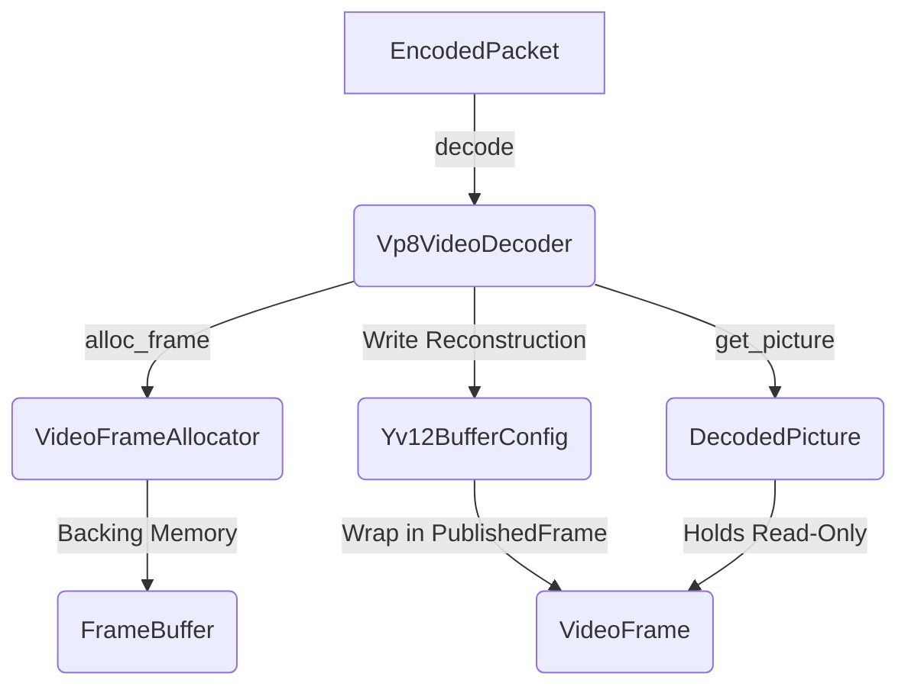

# Implementation Plan: Unified VideoDecoder API for VP8 Decoder

This document outlines a highly detailed, step-by-step implementation plan to wrap the transliterated VP8 Rust decoder (`libvpx-rs`) inside the codec-agnostic `VideoDecoder` API defined in `documentation/decoder_api_design.md`.

---

## 🏗️ Architectural Overview

The unified API operates on a **Zero-Copy Allocation** design where the caller controls frame memory via the `VideoFrameAllocator` trait, and the decoder writes to these buffers directly. 



---

## 📅 Step-by-Step Implementation Plan

### Phase 1: Codec-Agnostic API Setup (`rust/src/api/`)
We will populate the empty `rust/src/api` directory with the exact clean-room API definition files from Hibernia.

1. **`color.rs`**: 
   - Define orthogonal color signaling enums (`ColorPrimaries`, `TransferCharacteristics`, `MatrixCoefficients`).
   - Define `ColorRange` (Limited/Full) and the aggregate `ColorSpace` struct.
   - Define `PixelFormat` (YUV formats: `I420`, `NV12`, `I422`, `I444`, `Monochrome`).
   - Define `VideoPlane` (`Y`, `U`, `V`, `UV`, `Alpha`).
2. **`config.rs`**:
   - Define `Codec` enum supporting `H264`, `VP8`, `VP9`, `AV1`, `AV2`.
   - Define `LatencyMode` enum (`Throughput`, `LowLatency`).
   - Define `DecoderConfig` with dynamic, dynamic `Box<dyn Any + Send>` params.
3. **`format.rs`**:
   - Define `StreamFormat` containing the stream parameters: resolutions, display crops, color spaces, pixel format, and bit depth.
4. **`frame.rs`**:
   - Define `PlaneView` (representing the borrowed visible slice of a single plane).
   - Define the `VideoFrame` trait (shared read-only view of YUV planes).
   - Define `PlaneAllocation` and `BufferAllocation` requests.
   - Define the `FrameBuffer` trait (user-supplied backing allocation exposing `NonNull<u8>`).
   - Define the `VideoFrameAllocator` trait.
5. **`packet.rs`**:
   - Define `EncodedPacket` (owning bitstream data + opaque user metadata like timestamps).
   - Define `DecodedPicture` (owning the published `Arc<dyn VideoFrame>` + metadata).
6. **`callbacks.rs`**:
   - Define `VideoDecoderCallbacks` trait (`on_picture_available`, `on_format_changed`).
   - Define `DecoderError` enum.
7. **`default_allocator.rs`**:
   - Define `DefaultAllocator` (standard heap-allocated backing memory for systems not requiring custom pool management).
8. **`decoder.rs`**:
   - Define `FlushMode` enum (`Discard`, `Drain`).
   - Define the main `VideoDecoder` trait.
   - Define the `create_decoder` factory function routing `Codec::VP8` to our wrapper.
9. **`mod.rs`**:
   - Export all unified modules.
10. **Update `lib.rs`**:
    - Register `pub mod api;` at the top of `rust/src/lib.rs`.

---

### Phase 2: Integrate Allocator with `Yv12BufferConfig`
We will modify `Yv12BufferConfig` to keep a reference to the external `FrameBuffer` so the user-allocated memory remains alive for as long as the DPB or renderer references it.

1. **Modify `types.rs`**:
   - In `pub struct Yv12BufferConfig`, append:
     ```rust
     pub ext_buffer: Option<std::sync::Arc<dyn crate::api::FrameBuffer>>,
     ```
2. **Add External Allocator Bridge to `yv12config.rs`**:
   - Implement `vp8_yv12_alloc_external_frame_buffer` which:
     - Takes `&mut Yv12BufferConfig`, `width`, `height`, `border`, and `&dyn VideoFrameAllocator`.
     - Computes luma/chroma strides and plane sizes matching VP8's padding requirements (e.g. `border = 32`).
     - Builds a `BufferAllocation` request.
     - Calls `allocator.alloc_frame(&req)`.
     - Resolves raw plane pointers and sets the `y_region`, `u_region`, and `v_region` fields.
     - Stores the `Box<dyn FrameBuffer>` (as `Arc`) in the new `ext_buffer` field.

---

### Phase 3: Adapt Core Decoder and Resolution Change
We will update `Vp8AlgPriv` to hold the optional `allocator` and route it to the resolution change mechanism.

1. **Modify `Vp8AlgPriv` in `vp8_dx_iface.rs`**:
   - Add `pub allocator: Option<std::sync::Arc<dyn crate::api::VideoFrameAllocator>>` to the struct.
2. **Update `vp8_decode` and `vp8_decode_resolution_change`**:
   - If `allocator` is present:
     - Replace calls to `vp8_alloc_frame_buffers` (which uses standard heap) with custom loops that allocate all references (`oci.yv12_fb[i]`) using `vp8_yv12_alloc_external_frame_buffer` and the provided allocator.

---

### Phase 4: Create `PublishedFrame`
We will define how a completed `Yv12BufferConfig` is exposed to the user.

1. **Define `PublishedFrame`**:
   - Implement the `VideoFrame` trait over a shared reference to a decoded `Yv12BufferConfig`.
   - Slice the internal memory starting from the luma/chroma origin advanced by the border, matching the exact width and height.
   - Retrieve plane view pointers securely via:
     ```rust
     let origin = cfg.border * cfg.stride + cfg.border;
     ```

---

### Phase 5: Implement the `VideoDecoder` wrapper (`Vp8VideoDecoder`)
We will implement `VideoDecoder` over a wrapper struct.

1. **Define `Vp8VideoDecoder`**:
   - Owns:
     - An inner `Vp8Decoder` instance.
     - `allocator: Arc<dyn VideoFrameAllocator>`.
     - `callbacks: Arc<dyn VideoDecoderCallbacks>`.
     - `out_queue: VecDeque<DecodedPicture>` for display-order outputs.
     - `pending_opaque: Option<Box<dyn Any + Send>>` to propagate opaque packets.
2. **Implement Methods**:
   - `decode()`: Passes packet bytes to the VP8 core decoder. If successfully decoded:
     - Pulls the decoded picture using `get_frame()`.
     - Packages it inside `DecodedPicture` with the propagated opaque metadata.
     - Pushes it to `out_queue` and calls `callbacks.on_picture_available()`.
   - `get_picture()`: Pops and returns the next `DecodedPicture` from `out_queue`.
   - `flush()`:
     - `FlushMode::Discard`: Clears the output queues and resets state.
     - `FlushMode::Drain`: Flushes all frames in the DPB.
   - `control()`: Forwards commands (e.g., getting quantizers or reference frames).

---

### Phase 6: Integration Testing
We will write a comprehensive integration test in `rust/tests/api_decoder_test.rs`:
1. Initialize the VP8 decoder using `create_decoder` with the unified config.
2. Feed it an `EncodedPacket` containing the VP8 keyframe from the conformance test vectors.
3. Verify that `on_format_changed` fires.
4. Pull the decoded frame via `get_picture()` and assert the pixel geometry and MD5 checksum are correct.
